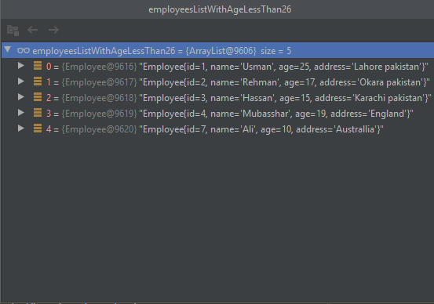

# java-listutils
List <> in different langaugea are evolving.New langauges are prviding more powerfull feratures to filter date from the list.
e.g findformlist, delete from list, etc. Java provide list functionality in the form of Streams but that required minimum API level <b>24</b> https://developer.android.com/reference/java/util/stream/Stream. so I decided to create list utils that can make your code clean and understandable.  
 

## Let start with some code

